# Haunt

> Transform AI language models into coordinated development teams with persistent memory, structured workflows, and enforced quality standards.

[](https://github.com/yourusername/haunt)
[](LICENSE)

---

## What Is Haunt?

**Haunt** is a lightweight framework that gives AI agents **persistent memory**, **specialized roles**, and **enforced best practices**—transforming one-off code generation into coordinated team development.

While traditional AI coding assistants forget everything between sessions, Haunt creates AI teammates that:
- ✅ **Remember your project conventions** across sessions
- ✅ **Coordinate parallel workstreams** without conflicts
- ✅ **Enforce quality standards** automatically
- ✅ **Track progress** through structured roadmaps
- ✅ **Maintain context** about architectural decisions

**The difference:** You're not just getting code suggestions—you're building with a team that has institutional knowledge.

---

## The Problem

Building software with AI assistants today means:

- 🔴 **Context loss** - Every conversation starts fresh, forgetting previous decisions
- 🔴 **Inconsistent quality** - Different prompts produce wildly different code quality
- 🔴 **No coordination** - Multiple AI agents can't work together effectively
- 🔴 **Manual tracking** - You're the project manager, tracker, and QA in addition to writing prompts

**Haunt solves this** by providing external memory (Rules, Skills, Roadmap), specialized agent roles, and automated quality enforcement.

---

## Key Features

### 🧠 External Memory System
LLMs are stateless, but Haunt provides **5 layers of persistent memory**:

| Layer | Purpose | Example |
|-------|---------|---------|
| **Rules** | Auto-loaded invariants | "Always verify tests pass before starting work" |
| **Agents** | Character sheets | "I am a Dev agent who follows TDD" |
| **Skills** | On-demand workflows | "How to write a commit message" |
| **CLAUDE.md** | Project context | "This is a REST API using FastAPI" |
| **Roadmap** | Working memory | "REQ-042: Implement JWT auth (In Progress)" |

**Result:** Agents remember your standards, patterns, and decisions across sessions.

### 👥 Specialized Agent Teams

Instead of one "do everything" assistant, Haunt provides **5 specialized agents**:

| Agent | Role | Capabilities |
|-------|------|--------------|
| **Project Manager** | Coordinator | Requirements analysis (JTBD, Kano, RICE), roadmap planning, batch coordination |
| **Dev** | Implementation | Backend/Frontend/Infrastructure modes, TDD workflow, automatic commit generation |
| **Research** | Investigation | Technical research, library evaluation, documentation validation |
| **Code Reviewer** | Quality Gate | Pattern detection, PR review, merge coordination |
| **Release Manager** | Deployment | Release coordination, changelog generation, deployment orchestration |

**Coordination:** Agents communicate through the **roadmap** (status updates, blockers, dependencies)—no direct agent-to-agent communication needed.

#### Agent Coordination Flow

The diagram below illustrates how agents coordinate asynchronously through the roadmap:



**Key Coordination Principles:**
1. **Roadmap as Single Source of Truth** - All agents read/write to `.haunt/plans/roadmap.md`
2. **Status-Based Communication** - Agents update status icons (⚪ → 🟡 → 🟢 → 🔴) to signal progress
3. **No Direct Agent Communication** - Agents never talk to each other; roadmap mediates all coordination
4. **Asynchronous Execution** - Agents work independently, PM unblocks when needed
5. **Visible Progress** - All status changes immediately visible to entire team

### 📋 Roadmap-Driven Development

**Single source of truth:** `.haunt/plans/roadmap.md`

```markdown
## Batch 1: Foundation (parallel execution)

### 🟡 REQ-001: Database schema for tasks
**Agent:** Dev-Backend | **Effort:** S (1-2hr) | **Complexity:** SIMPLE
**Status:** In Progress
- [x] Create User model
- [x] Create Task model
- [ ] Write migration

### ⚪ REQ-002: React app structure
**Agent:** Dev-Frontend | **Effort:** S (1-2hr) | **Complexity:** SIMPLE
**Status:** Not Started
**Blocked by:** None

## Batch 2: Features (sequential, after Batch 1)

### ⚪ REQ-003: Task CRUD API
**Agent:** Dev-Backend | **Effort:** M (2-4hr) | **Complexity:** MODERATE
**Blocked by:** REQ-001
```

**Features:**
- Visual status tracking (⚪ Not Started, 🟡 In Progress, 🟢 Complete, 🔴 Blocked)
- Dependency chains prevent premature work
- Batch organization enables parallel execution
- **Effort sizing** (time/scope): XS: <1hr, S: 1-2hr, M: 2-4hr, SPLIT: decompose immediately
- **Complexity indicators** (cognitive difficulty): SIMPLE (obvious), MODERATE (some investigation), COMPLEX (significant unknowns), UNKNOWN (needs research spike)
- Automatic archival when complete

### ⚡ Quality Enforcement

**No shortcuts allowed.** Before marking work complete, agents verify:

1. ✅ All task checkboxes marked `[x]`
2. ✅ Completion criteria met
3. ✅ **Tests passing** (pytest/npm test)
4. ✅ Files modified as specified
5. ✅ Documentation updated (if applicable)
6. ✅ Security review completed (if code involves user input, auth, databases, external APIs, file operations, or dependencies)
7. ✅ Self-validation performed (agent re-read requirement, reviewed own code, confirmed tests actually test the feature)

**Standardized commits:**
```
[REQ-042] Add: JWT authentication endpoints

What was done:
- Created POST /auth/login endpoint with JWT generation
- Added token refresh endpoint
- Implemented rate limiting (10 req/min)

🤖 Generated with Claude Code
```

**Pattern detection:** TDD for agent behavior—when agents make mistakes, defeat tests prevent recurrence.

### 🔄 Automated Workflows

**19 slash commands** for common tasks:

| Command | Purpose |
|---------|---------|
| `/seance` | Full workflow orchestration (idea → requirements → roadmap → implementation) |
| `/haunt` | Summon parallel agent team for complex features |
| `/decompose` | Break down large requirements into smaller pieces |
| `/qa` | Generate test scenarios from requirements |
| `/ritual` | Run weekly refactor session |
| `/witching-hour` | Intensive debugging workflow |
| `/bind` | Create custom rule overrides for specific files |
| `/haunt` | Status check and health verification |
| `/haunt-report` | Report bugs or feature requests to Haunt maintainers |

**Automatic session startup (every session, every agent):**
```bash
1. Verify environment: pwd && git status
2. Check recent changes: git log --oneline -5
3. Verify tests pass: pytest tests/ -x -q
4. Find assignment: Active Work → Roadmap → Ask PM
```

### 🎯 Strategic Planning

Project Manager agent performs **strategic analysis** on all requirements:

- **Jobs-To-Be-Done (JTBD):** Understand user motivations
- **Kano Model:** Categorize features (Basic, Performance, Delight)
- **RICE Scoring:** Reach × Impact × Confidence / Effort prioritization
- **SWOT Analysis:** Strengths, Weaknesses, Opportunities, Threats
- **VRIO Framework:** Value, Rarity, Imitability, Organization

**Result:** Work on high-impact features first, with clear business justification.

---

## Quick Start

### Installation (3 commands)

```bash
# 1. Clone repository
git clone https://github.com/yourusername/haunt.git
cd haunt

# 2. Run setup
bash Haunt/scripts/setup-haunt.sh

# 3. Verify installation
bash Haunt/scripts/setup-haunt.sh --verify
```

**What setup does:**
- Copies agent character sheets to `~/.claude/agents/`
- Installs rules to `~/.claude/rules/` (auto-loaded every session)
- Deploys skills to `~/.claude/skills/` (on-demand)
- Creates project structure (`.haunt/plans/`, `.haunt/completed/`, etc.)

### Your First Project

**Step 1: Start with Project Manager**
```bash
claude -a project-manager
```

```
You: "I want to build a REST API for managing book reviews.
     Users can register, log in, post reviews, and rate books."
```

PM will:
1. Confirm understanding
2. Generate formal requirements document
3. Perform strategic analysis (JTBD, Kano, RICE)
4. Create roadmap with sized requirements
5. Assign agents to requirements

**Step 2: Implement with Dev Agent**
```bash
claude -a dev
```

Agent automatically:
- Runs session startup (verify tests, check git, find assignment)
- Implements feature following TDD workflow
- Updates roadmap status (⚪ → 🟡 → 🟢)
- Creates commit: `[REQ-001] Add: User registration endpoint`

**Step 3: Review with Code Reviewer**
```bash
claude -a code-reviewer
```

Reviewer verifies:
- Tests passing
- No anti-patterns detected
- Commit messages follow convention
- Implementation matches completion criteria

**Step 4: Track Progress**

Check `.haunt/plans/roadmap.md`:
```markdown
**Active Work:**
- 🟢 REQ-001: User registration endpoint (Complete)
- 🟡 REQ-002: Login with JWT (In Progress)
- ⚪ REQ-003: Book review CRUD (Not Started)
```

---

## How It Works: The Séance Workflow

Haunt implements a three-phase workflow that transforms user ideas into structured, agent-ready requirements:


### Phase 1: Scrying 🔮 (Requirements Development)
**Input:** User idea or feature request
**Output:** Formal requirements document (REQ-XXX.md)

The PM agent extracts core needs, identifies constraints, and generates structured requirements with clear acceptance criteria.

### Phase 2: Summoning 👻 (Strategic Analysis)
**Input:** Requirements document
**Output:** Analysis document with prioritization

Strategic frameworks provide business context:
- **Jobs-to-be-Done:** Why users need this feature
- **Kano Model:** Feature classification (basic/performance/delight)
- **RICE Scoring:** Prioritization based on reach, impact, confidence, effort

### Phase 3: Reaping 🌾 (Roadmap Creation)
**Input:** Analysis document
**Output:** Updated roadmap with sized, assigned requirements

Requirements decomposed into agent-ready tasks:
- Effort sizing (XS/S/M based on hours and file count)
- Agent assignment (Dev-Backend, Dev-Frontend, etc.)
- Dependency identification
- Batch organization for parallel execution

**Result:** Ready for implementation with clear scope, priorities, and assignments.

---

## Architecture Overview

### The Four-Layer System

```
┌──────────────────────────────────────────────┐
│ AGENTS (WHO you are)                         │ ← 30-50 lines each
│   Character sheets, tool permissions         │   Loaded on spawn
├──────────────────────────────────────────────┤
│ RULES (You MUST do this)                     │ ← 50-100 lines each
│   Invariant enforcement, auto-loaded         │   Always enforced
├──────────────────────────────────────────────┤
│ SKILLS (HOW to do this)                      │ ← 100-500 lines each
│   Reusable workflows, on-demand              │   Loaded when invoked
├──────────────────────────────────────────────┤
│ COMMANDS (Shortcuts)                         │ ← User-invoked
│   Common task automation                     │   19 total
└──────────────────────────────────────────────┘
```

### Why This Layering Matters

**Agents are lightweight** (30-50 lines) because they **reference** skills rather than duplicating workflows.

**Rules are always on** because they enforce invariants that must **never** be violated.

**Skills are on-demand** because they're detailed guidance only needed in specific contexts.

**Commands are shortcuts** for tasks users would otherwise type manually.

### v2.0 vs v1.0

| Aspect | v1.0 (Monolithic) | v2.0 (Lightweight) |
|--------|-------------------|-------------------|
| Agent file size | 200+ lines | 30-50 lines |
| Workflow duplication | Duplicated in every agent | Shared via skills |
| Maintenance | Update 5 agents for one change | Update 1 skill |
| Loading speed | Slower (large files) | 85% faster |
| Customization | Edit entire agent | Swap skills |

---

## What Makes Haunt Unique

### 1. External Memory for Stateless LLMs
Rules, skills, and roadmap provide **persistent institutional knowledge** that survives across sessions.

### 2. Roadmap as Communication Layer
Agents coordinate through **status updates** in the roadmap—no direct agent-to-agent communication needed.

### 3. One-Feature-Per-Session Rule
Everything sized to complete in **one sitting** (max 4 hours)—prevents context sprawl and ensures atomic commits.

### 4. TDD for Agent Behavior
**Pattern detection tests** ensure agents learn from mistakes:
- Pattern Found → Test Written → Agent Trained → Pattern Defeated

### 5. Human-in-the-Loop Autonomy
Agents handle **implementation details** (code, tests, commits), humans approve **architecture and releases**.

### 6. Selective SDK Integration
Uses SDK infrastructure (prompt caching, tool permissions) without replacing custom methodology.

---

## Real-World Workflows

### Parallel Development (Haunt Mode)
```
User: "Add dark mode to the app"

Project Manager:
  ├─> REQ-001: Dark mode toggle component (Dev-Frontend)
  ├─> REQ-002: Theme state management (Dev-Frontend)
  ├─> REQ-003: API for user theme preference (Dev-Backend)
  └─> REQ-004: Update CSS variables (Dev-Frontend)

All agents work simultaneously, PM tracks completion
```

### Weekly Refactor Ritual
```bash
claude -a project-manager
> /ritual weekly-refactor

Agent runs:
1. Code quality scan (pattern detection)
2. Test coverage analysis
3. Technical debt review
4. Agent prompt optimization
5. Documentation updates
```

### Intensive Debugging (Witching Hour)
```bash
claude -a dev
> /witching-hour

Agent workflow:
1. Enable verbose logging
2. Reproduce issue systematically
3. Correlate patterns across errors
4. Write failing test that captures bug
5. Fix and verify
6. Create defeat test to prevent recurrence
```

---

## File Organization

### Project Structure
```
.haunt/
├── plans/
│   └── roadmap.md                # Single source of truth
├── completed/                    # Archived requirements
├── progress/                     # Session notes
├── tests/
│   ├── patterns/                 # Pattern defeat tests
│   ├── behavior/                 # Agent behavior tests
│   └── e2e/                      # End-to-end tests
└── docs/
    ├── research/                 # Investigation findings
    └── validation/               # Review reports
```

### Framework Structure
```
Haunt/
├── agents/                       # Character sheets (source)
│   ├── gco-dev.md
│   ├── gco-project-manager.md
│   ├── gco-research.md
│   ├── gco-code-reviewer.md
│   └── gco-release-manager.md
├── rules/                        # Invariant enforcement (source)
│   ├── gco-session-startup.md
│   ├── gco-commit-conventions.md
│   ├── gco-completion-checklist.md
│   └── ...
├── skills/                       # Reusable workflows (source)
│   ├── gco-tdd-workflow/
│   ├── gco-roadmap-planning/
│   ├── gco-requirements-analysis/
│   └── ...
├── commands/                     # Slash commands
│   ├── seance.md
│   ├── haunt-gather.md
│   └── ...
└── scripts/
    ├── setup-haunt.sh            # One-command install
    └── validation/               # Verification scripts
```

---

## Documentation

| Document | Purpose |
|----------|---------|
| **README.md** | This file - overview and quick start |
| **[SETUP-GUIDE.md](SETUP-GUIDE.md)** | Complete installation instructions |
| **[QUICK-REFERENCE.md](QUICK-REFERENCE.md)** | Cheat sheet for commands, agents, skills |
| **[docs/WHITE-PAPER.md](docs/WHITE-PAPER.md)** | Framework design philosophy |
| **[docs/SEANCE-EXPLAINED.md](docs/SEANCE-EXPLAINED.md)** | Complete Séance workflow guide (idea → shipped features) |
| **[docs/SDK-INTEGRATION.md](docs/SDK-INTEGRATION.md)** | How SDK features integrate |
| **[docs/TOOL-PERMISSIONS.md](docs/TOOL-PERMISSIONS.md)** | Agent tool access reference |
| **[docs/SKILLS-REFERENCE.md](docs/SKILLS-REFERENCE.md)** | Complete skills catalog |
| **[docs/PATTERN-DETECTION.md](docs/PATTERN-DETECTION.md)** | Pattern detection methodology |
| **[docs/HAUNT-DIRECTORY-SPEC.md](docs/HAUNT-DIRECTORY-SPEC.md)** | Directory structure specification |

---

## Integration & Compatibility

### Works With
- ✅ **Claude Code CLI** (primary interface)
- ✅ **Anthropic Claude API** (via SDK integration)
- ✅ **MCP Servers** (Context7, Playwright, Agent Memory)
- ✅ **GitHub Actions** (pattern tests in CI/CD)
- ✅ **VS Code / Cursor** (via Claude Code)

### Hybrid Agent Patterns
Haunt agents work seamlessly with Claude Code's built-in agents:

- **Explore → gco-dev**: Research existing code, then implement changes
- **Plan → gco-project-manager**: Strategic planning, then formal roadmapping
- **general-purpose → gco-code-reviewer**: Implement, then review (prevents self-review bias)

See [docs/INTEGRATION-PATTERNS.md](docs/INTEGRATION-PATTERNS.md) for detailed examples.

---

## FAQ

### Do I need to install MCP servers?
**Optional.** Haunt works without MCP, but Context7 (docs lookup) and Playwright (E2E tests) enhance capabilities.

### Can I use Haunt with existing projects?
**Yes.** Run `bash Haunt/scripts/setup-haunt.sh --project-only` in any project to add Haunt workflows.

### How do I customize an agent for my project?
Copy to `./.claude/agents/` (project-specific) and modify. Project agents override global agents.

### What if I want to remove Haunt?
```bash
claude /exorcism  # Removes all Haunt artifacts from current project
```

### Can I use both v1.0 and v2.0?
**Not recommended.** Choose one architecture per project to avoid conflicting instructions.

### How much does this cost?
Haunt is **MIT licensed** and free. You pay only for Claude API usage (same as any Claude Code usage).

### Does this work with other LLMs?
Currently designed for **Claude** via Claude Code CLI. SDK-based features require Anthropic Claude API.

---

## Roadmap

**Current (v2.0):** Lightweight architecture with skills library

**Upcoming:**
- GitHub Issues integration (auto-convert issues to roadmap items)
- Custom bindings for project-specific rule overrides
- Browser-based agent dashboard for roadmap visualization
- Enhanced pattern detection with ML-based code smell identification
- Community skills marketplace

See [.haunt/plans/roadmap.md](.haunt/plans/roadmap.md) for detailed feature tracking.

---

## Contributing

We welcome contributions! Here's how:

1. **Report bugs/patterns:** Use `/issue-to-roadmap` to log issues
2. **Submit skills:** Create `Haunt/skills/your-skill/SKILL.md` with YAML frontmatter
3. **Improve agents:** Suggest character sheet refinements
4. **Share workflows:** Document your team's Haunt usage patterns

See [CONTRIBUTING.md](CONTRIBUTING.md) for guidelines.

---

## License

MIT License - see [LICENSE](LICENSE) for details.

---

## Credits

**Created by:** Mike Heckathorn
**Framework:** Haunt (Ghost County project)
**Powered by:** Claude (Anthropic)
**Inspired by:** Years of trying to make AI agents remember what they learned yesterday

---

## Getting Help

- **Quick questions:** Check [QUICK-REFERENCE.md](QUICK-REFERENCE.md)
- **Setup issues:** Read [SETUP-GUIDE.md](SETUP-GUIDE.md)
- **Deep dives:** Explore [docs/WHITE-PAPER.md](docs/WHITE-PAPER.md)
- **Bug reports:** Use `claude /haunt-report` to create issues with automatic diagnostics

---

**Ready to build with AI teammates who actually remember your project?**

```bash
bash Haunt/scripts/setup-haunt.sh
claude -a project-manager
```

Let's haunt some code. 👻
