# Haunt v2.0 - Comprehensive Setup Guide

> Complete setup instructions for Haunt v2.0 environment

---

## Table of Contents

1. [Quick Start](#quick-start)
2. [Prerequisites](#prerequisites)
3. [Installation](#installation)
4. [Verification](#verification)
5. [Common Setup Scenarios](#common-setup-scenarios)
6. [Troubleshooting](#troubleshooting)
7. [Advanced Configuration](#advanced-configuration)
8. [Next Steps](#next-steps)

---

## Quick Start

**For impatient users: Complete setup in 4 commands**

### macOS / Linux

```bash
# 1. Clone repository
git clone https://github.com/ghost-county/ghost-county.git
cd ghost-county

# 2. Run setup script
bash Haunt/scripts/setup-haunt.sh

# 3. Verify installation
bash Haunt/scripts/setup-haunt.sh --verify

# 4. (Optional) Remove repository clone
cd .. && rm -rf ghost-county
```

**Alternative: Remote installation (one-liner)**
```bash
# Quick install via curl (may fail on some networks - see Troubleshooting Issue 11)
curl -fsSL https://raw.githubusercontent.com/ghost-county/ghost-county/main/Haunt/scripts/setup-haunt.sh | bash
```
**Note:** If the curl command fails with "Failed to clone repository", use the manual method above instead.

### Windows (PowerShell)

**Recommended: Use Git Bash on Windows**
```bash
# 1. Clone repository
git clone https://github.com/ghost-county/ghost-county.git
cd ghost-county

# 2. Run setup script
bash Haunt/scripts/setup-haunt.sh

# 3. Verify installation
bash Haunt/scripts/setup-haunt.sh --verify

# 4. (Optional) Remove repository clone
cd .. && rm -rf ghost-county
```

**Alternative: PowerShell (if available)**
```powershell
# 1. Clone repository
git clone https://github.com/ghost-county/ghost-county.git
cd ghost-county

# 2. Run setup script
.\Haunt\scripts\setup-haunt.ps1

# 3. Verify installation
.\Haunt\scripts\setup-haunt.ps1 -Verify

# 4. (Optional) Remove repository clone
cd .. ; Remove-Item -Recurse -Force ghost-county
```

**First command to try:**
```bash
# Start a development session with the dev agent
claude -a dev
```

---

## Prerequisites

**Note:** The setup script will interactively prompt to install missing dependencies. Use `--yes` or `-Yes` flag to auto-install without prompts.


### Required Dependencies

#### 1. Git (version control)
**Purpose:** Version control for code and agent definitions

```bash
# Check if installed
git --version

# Install on macOS
brew install git

# Install on Ubuntu/Debian
sudo apt-get install git

# Install on CentOS/RHEL
sudo yum install git

# Install on Windows
winget install Git.Git
# Or download from: https://git-scm.com/download/win
```

**Configure Git:**
```bash
git config --global user.name "Your Name"
git config --global user.email "your.email@example.com"
```

#### 2. Python 3.11+ (for MCP servers)
**Purpose:** Required for Agent Memory and Context7 MCP servers

```bash
# Check version
python3 --version   # macOS/Linux
python --version    # Windows

# Install on macOS
brew install python@3.11

# Install on Ubuntu/Debian
sudo apt-get install python3.11 python3.11-venv

# Install on CentOS/RHEL
sudo yum install python311

# Install on Windows
winget install Python.Python.3.11
# Or download from: https://python.org/downloads/
```

#### 3. Node.js 18+ (for Claude Code CLI)
**Purpose:** Claude Code CLI and npm package management

```bash
# Check version
node --version

# Install on macOS
brew install node

# Install on Ubuntu/Debian
curl -fsSL https://deb.nodesource.com/setup_18.x | sudo -E bash -
sudo apt-get install -y nodejs

# Install on Windows
winget install OpenJS.NodeJS.LTS
# Or download from: https://nodejs.org/

# Install with nvm (recommended for version management)
nvm install 18
nvm use 18
```

#### 4. Claude Code CLI
**Purpose:** Core interface for interacting with Claude agents

```bash
# Install globally
npm install -g @anthropic-ai/claude-code

# Verify installation
claude --version

# See available agents
claude --list-agents
```

### Optional Dependencies

#### 5. uv Package Manager (recommended)
**Purpose:** Fast Python package and MCP server management

```bash
# Install on macOS/Linux
curl -LsSf https://astral.sh/uv/install.sh | sh

# Install on Windows (PowerShell)
irm https://astral.sh/uv/install.ps1 | iex

# Verify installation
uv --version
```

**Why uv?**
- 10-100x faster than pip
- Built-in virtual environment management
- Simplifies MCP server installation
- Required for `uvx` commands in documentation

#### 6. Playwright (for E2E testing)
**Purpose:** Browser automation for end-to-end tests

```bash
# Install via npm
npm install -D @playwright/test

# Install browsers
npx playwright install
```

#### 7. 1Password CLI (for secrets management)
**Purpose:** Secure secret management via 1Password integration

```bash
# Install on macOS (Homebrew)
brew install 1password-cli

# Install on Linux (Debian/Ubuntu)
curl -sS https://downloads.1password.com/linux/keys/1password.asc | \
  sudo gpg --dearmor --output /usr/share/keyrings/1password-archive-keyring.gpg

echo "deb [arch=$(dpkg --print-architecture) signed-by=/usr/share/keyrings/1password-archive-keyring.gpg] \
  https://downloads.1password.com/linux/debian/$(dpkg --print-architecture) stable main" | \
  sudo tee /etc/apt/sources.list.d/1password.list

sudo apt update && sudo apt install 1password-cli

# Install on Windows (winget)
winget install AgileBits.1Password.CLI

# Verify installation
op --version
```

**Setup:**
1. Get service account token from https://my.1password.com → Settings → Developer → Service Accounts
2. Set environment variable:
   ```bash
   export OP_SERVICE_ACCOUNT_TOKEN="ops_your_token_here"
   ```
3. Verify authentication:
   ```bash
   op vault list  # Should list your vaults
   ```

**See:** [Haunt/docs/SECRETS-MANAGEMENT.md](docs/SECRETS-MANAGEMENT.md) for complete integration guide.

---

## MCP (Model Context Protocol) Setup

MCP servers provide persistent memory and context to Claude Code agents. The setup script automatically configures the Agent Memory MCP server.

### What is Agent Memory?

Agent Memory provides a 5-layer memory hierarchy for persistent context across sessions:

| Layer | Retention | What to Store |
|-------|-----------|---------------|
| Core | Forever | Agent identity, role, relationships |
| Long-term | Forever | Major insights, project milestones |
| Medium-term | 7 days | Patterns from this week |
| Recent | 24 hours | Today's tasks and learnings |
| Compost | 30 days | Failed/rejected ideas |

### Automatic MCP Setup

The setup script handles MCP configuration automatically:

```bash
# Full setup includes MCP configuration
bash Haunt/scripts/setup-haunt.sh

# Or MCP-only setup
bash Haunt/scripts/setup-haunt.sh --mcp-only

# Skip MCP setup
bash Haunt/scripts/setup-haunt.sh --no-mcp
```

**What the script does:**
1. Creates `~/.claude/mcp-servers/` directory
2. Deploys `agent-memory-server.py`
3. Creates `~/.agent-memory/` data directory
4. Updates `~/.claude/settings.json` with MCP configuration
5. Checks for `mcp` Python package installation
6. Tests that server starts without errors

### Manual MCP Setup (if needed)

If automatic setup fails or you prefer manual configuration:

#### Step 1: Install MCP Python Package

```bash
# With pip
pip install mcp

# Or with uv (faster)
uv pip install mcp
```

#### Step 2: Deploy Server File

```bash
# Copy server to MCP directory
mkdir -p ~/.claude/mcp-servers
cp Haunt/scripts/utils/agent-memory-server.py ~/.claude/mcp-servers/

# Make executable
chmod +x ~/.claude/mcp-servers/agent-memory-server.py
```

#### Step 3: Configure settings.json

Edit `~/.claude/settings.json` and add:

```json
{
  "mcpServers": {
    "agent-memory": {
      "command": "python3",
      "args": ["/Users/YOUR_USERNAME/.claude/mcp-servers/agent-memory-server.py"]
    }
  }
}
```

**Note:** Replace `YOUR_USERNAME` with your actual username.

#### Step 4: Create Memory Directory

```bash
mkdir -p ~/.agent-memory
```

#### Step 5: Restart Claude Code

MCP servers are loaded on startup. Restart Claude Code to activate the memory tools.

### Verifying MCP Setup

Check that the MCP server is working:

```bash
# Test server startup
python3 ~/.claude/mcp-servers/agent-memory-server.py --test

# Or use the verification script
python3 Haunt/scripts/utils/test-mcp-server.py

# Check settings.json configuration
jq '.mcpServers["agent-memory"]' ~/.claude/settings.json

# Verify memory directory exists
test -d ~/.agent-memory && echo "Memory directory OK"
```

Expected output from test:
```
Testing MCP server at: /Users/username/.claude/mcp-servers/agent-memory-server.py
✓ Dependencies check passed
✓ MCP server test passed - server starts successfully
```

### Using Agent Memory

Once configured, agents can use memory tools:

```python
# At session startup (for multi-session features)
recall_context("dev-backend")  # Retrieve previous context

# During work
add_recent_task("Implemented JWT authentication")
add_recent_learning("N+1 queries prevented with eager loading")
add_long_term_insight("Always version APIs - prevents breaking changes")

# Weekly consolidation
run_rem_sleep()  # Compress recent → patterns → insights
```

### MCP Best Practices

**What to store:**
- Architectural decisions and their rationale
- Learned patterns and anti-patterns
- Edge cases discovered during development
- Project conventions and standards
- Cross-session context for M-sized features

**What NOT to store:**
- Implementation details (code is in git)
- Full file contents (git has history)
- Obvious facts or verbose explanations
- Temporary debugging information

**Compression test:** Can you express this insight in 1-2 sentences? If not, it's too verbose.

### Troubleshooting MCP

**Issue: "Python 'mcp' package not found"**
```bash
# Install with pip
pip install mcp

# Or with uv
uv pip install mcp

# Verify installation
python3 -c "import mcp; print('MCP installed')"
```

**Issue: "Server starts but memory tools not available"**
- Restart Claude Code to reload MCP configuration
- Check settings.json has correct server path
- Verify server path uses absolute path (not ~)

**Issue: "jq not found" during setup**
```bash
# Install jq for settings.json editing
brew install jq  # macOS
apt-get install jq  # Ubuntu/Debian
```

**Issue: settings.json is corrupt after setup**
- Backup is automatically created at `~/.claude/settings.json.backup`
- Restore with: `cp ~/.claude/settings.json.backup ~/.claude/settings.json`
- Re-run setup: `bash Haunt/scripts/setup-haunt.sh`

### MCP Resources

- **Agent Memory Server Source:** `Haunt/scripts/utils/agent-memory-server.py`
- **Best Practices:** `.haunt/docs/research/agent-memory-best-practices.md`
- **MCP Specification:** https://modelcontextprotocol.io

---

## Installation

### Windows Installation

Haunt fully supports Windows via PowerShell. Choose one of these methods:

#### Method 1: Local Installation (Recommended)

```powershell
# 1. Clone the repository
git clone https://github.com/ghost-county/ghost-county.git
cd ghost-county

# 2. Run the PowerShell setup script
.\Haunt\scripts\setup-haunt.ps1

# 3. Verify installation
.\Haunt\scripts\setup-haunt.ps1 -Verify

# 4. Start your first session
claude -a dev
```

#### Method 2: Remote Installation (One-Liner)

```powershell
# Quick install - downloads and runs setup automatically
irm https://raw.githubusercontent.com/ghost-county/ghost-county/main/Haunt/scripts/setup-haunt.ps1 | iex
```

#### Method 3: WSL (Windows Subsystem for Linux)

If you prefer bash, use WSL:

```powershell
# Enable WSL (run as Administrator)
wsl --install

# After restart, open Ubuntu and run:
git clone https://github.com/ghost-county/ghost-county.git
cd ghost-county
bash Haunt/scripts/setup-haunt.sh
```

#### PowerShell Script Options

```powershell
# Full setup (default: project-local)
.\setup-haunt.ps1

# Install to user-level (~/.claude/)
.\setup-haunt.ps1 -Scope global

# Install to both locations
.\setup-haunt.ps1 -Scope both

# Preview without making changes
.\setup-haunt.ps1 -DryRun

# Only install agents
.\setup-haunt.ps1 -AgentsOnly

# Verify and fix issues
# Auto-install missing dependencies without prompting
.\setup-haunt.ps1 -Yes

.\setup-haunt.ps1 -Verify -Fix

# Skip prerequisite checks
.\setup-haunt.ps1 -SkipPrereqs

# Show all options
Get-Help .\setup-haunt.ps1 -Detailed
```

---

### Scenario 1: First-Time Setup (New User)

**Goal:** Install Haunt v2.0 from scratch

**Steps (macOS/Linux):**
```bash
# 1. Clone or navigate to repository
cd /path/to/ghost-county

# 2. Run full setup
bash Haunt/scripts/setup-haunt.sh

# 3. Verify installation
bash Haunt/scripts/setup-haunt.sh --verify

# 4. Review installed agents
ls -la ~/.claude/agents/

# 5. Review available skills
ls -1 Haunt/skills/

# 6. Start your first session
claude -a dev
```

**Steps (Windows PowerShell):**

```powershell
# 1. Clone or navigate to repository
cd C:\path\to\ghost-county

# 2. Run full setup
.\Haunt\scripts\setup-haunt.ps1

# 3. Verify installation
.\Haunt\scripts\setup-haunt.ps1 -Verify

# 4. Review installed agents
Get-ChildItem $env:USERPROFILE\.claude\agents\

# 5. Review available skills
Get-ChildItem Haunt\skills\

# 6. Start your first session
claude -a dev
```

**What gets installed:**
- Global agent character sheets → `~/.claude/agents/`
  - gco-dev.md
  - gco-project-manager.md
  - gco-research.md
  - gco-code-reviewer.md
  - gco-release-manager.md
- Haunt skills verified in `Haunt/skills/`
- Directory structure created: `.haunt/plans/`, `.haunt/progress/`, `.haunt/completed/`, `.haunt/tests/`, `.claude/`

### Scenario 2: Updating Agents After Git Pull

**Goal:** Update global agents after pulling new agent definitions

**Steps:**
```bash
# 1. Pull latest changes
git pull origin master

# 2. Update agents only (skip project setup)
bash Haunt/scripts/setup-haunt.sh --agents-only

# 3. Verify update
bash Haunt/scripts/setup-haunt.sh --verify

# 4. Check agent versions/changes
diff ~/.claude/agents/gco-dev.md Haunt/agents/gco-dev.md
```

### Scenario 3: Adding to Existing Project

**Goal:** Add Haunt to an existing codebase

**Steps:**
```bash
# 1. Navigate to your project
cd /path/to/your-project

# 2. Run project-only setup (skip global agents)
bash /path/to/ghost-county/Haunt/scripts/setup-haunt.sh --project-only

# 3. (Optional) Create project-specific agent overrides
mkdir -p .claude/agents

# 4. (Optional) Copy and customize agents
cp /path/to/ghost-county/Haunt/agents/gco-dev.md .claude/agents/gco-dev.md
# Edit .claude/agents/gco-dev.md for project-specific customization

# 5. Start session
claude -a dev
```

**Project-specific vs Global Agents:**
- Global: `~/.claude/agents/*.md` (apply to all projects)
- Project: `./.claude/agents/*.md` (override global for this project only)

### Scenario 4: Dry Run (Preview Changes)

**Goal:** See what setup would do without making changes

**Steps:**
```bash
# Preview full setup
bash Haunt/scripts/setup-haunt.sh --dry-run

# Preview agents-only update
bash Haunt/scripts/setup-haunt.sh --agents-only --dry-run

# Preview with verbose output
bash Haunt/scripts/setup-haunt.sh --dry-run --verbose
```

---

## Verification

### Automatic Verification

```bash
# Run all verification checks
bash Haunt/scripts/setup-haunt.sh --verify

# Verify and auto-fix issues
bash Haunt/scripts/setup-haunt.sh --verify --fix
```

### Manual Verification

**Check 1: Global agents installed**
```bash
ls -la ~/.claude/agents/
# Expected output:
# gco-dev.md
# gco-project-manager.md
# gco-research.md
# gco-code-reviewer.md
# gco-release-manager.md
```

**Check 2: Skills directory exists**
```bash
ls -1 Haunt/skills/
# Expected output (partial list):
# session-startup/
# commit-conventions/
# tdd-workflow/
# requirements-rubric/
# code-review/
```

**Check 3: Claude Code CLI recognizes agents**
```bash
claude --list-agents
# Expected: Shows dev, project-manager, research, etc.
```

**Check 4: Agent files are valid**
```bash
# Validate agent format
bash Haunt/scripts/validation/validate-agents.sh

# Validate skills format
bash Haunt/scripts/validation/validate-skills.sh

# Validate agent-skill references
bash Haunt/scripts/validation/validate-agent-skills.sh
```

**Check 5: Test agent session**
```bash
# Start session (should not error)
claude -a dev --session test-session

# In session, agent should respond to:
# "What skills do you have available?"
# "Run session startup checklist"
```

---

## Common Setup Scenarios

### Scenario A: Corporate Environment (Restricted Internet)

**Challenge:** Cannot install global npm packages or access external repos

**Solution:**
```bash
# 1. Download Claude repo as zip/tarball on allowed machine
# 2. Transfer to restricted environment
# 3. Install dependencies from local cache
npm install --offline @anthropic-ai/claude-code

# 4. Point to local agent files instead of global
export CLAUDE_AGENTS_DIR=/path/to/ghost-county/Haunt/agents
claude -a dev
```

### Scenario B: Team Shared Agents

**Challenge:** Team wants consistent agent configuration across developers

**Solution:**
```bash
# 1. Create team repository for agent customizations
git init team-agents
cd team-agents

# 2. Copy base agents
cp /path/to/ghost-county/Haunt/agents/*.md ./

# 3. Customize for team standards
vim gco-dev.md  # Add team-specific coding standards

# 4. Team members clone and use
git clone https://github.com/yourteam/team-agents.git ~/.claude/agents

# 5. Update periodically
cd ~/.claude/agents && git pull
```

### Scenario C: Multiple Projects with Different Agent Configs

**Challenge:** Different projects need different agent behaviors

**Solution:**
```bash
# Project A: Strict TDD enforcement
cd project-a
mkdir -p .claude/agents
cp ~/.claude/agents/gco-dev.md .claude/agents/gco-dev.md
# Edit .claude/agents/gco-dev.md: Add "ALWAYS write tests first"

# Project B: Relaxed prototyping
cd project-b
mkdir -p .claude/agents
cp ~/.claude/agents/gco-dev.md .claude/agents/gco-dev.md
# Edit .claude/agents/gco-dev.md: Add "Tests optional for spikes"

# Claude Code automatically uses project-specific agents when present
```

### Scenario D: Rollback to v1.0

**Challenge:** v2.0 not working, need to revert to old framework

**Solution:**
```bash
# 1. Backup v2.0 agents
mv ~/.claude/agents ~/.claude/agents.v2.backup

# 2. Use old framework (v1.0 legacy)
cd /path/to/Claude
bash Agentic_SDLC_Framework/scripts/setup-all.sh --agents

# 3. Verify old agents
ls ~/.claude/agents/
# Should show v1.0 legacy monolithic agents (150-300 lines each)

# 4. To restore v2.0 later
rm -rf ~/.claude/agents
mv ~/.claude/agents.v2.backup ~/.claude/agents
```

---

## Troubleshooting

### Issue 1: "Permission denied" when creating ~/.claude/agents/

**Symptoms:**
```
✗ Error: Cannot create directory ~/.claude/agents/
Permission denied
```

**Cause:** Home directory permissions too restrictive

**Fix:**
```bash
# Option A: Fix permissions
mkdir -p ~/.claude/agents
chmod 755 ~/.claude/agents

# Option B: Use project-local agents instead
mkdir -p ./.claude/agents
export CLAUDE_AGENTS_DIR=./.claude/agents
bash scripts/setup-haunt.sh --agents-only
```

### Issue 2: Agents not found after setup

**Symptoms:**
```bash
claude -a dev
# Error: Agent 'dev' not found
```

**Diagnostic:**
```bash
# Check if files exist
ls -la ~/.claude/agents/*.md

# Check Claude Code config
claude --list-agents

# Check CLAUDE_AGENTS_DIR environment variable
echo $CLAUDE_AGENTS_DIR
```

**Fix:**
```bash
# Option A: Re-run setup
bash Haunt/scripts/setup-haunt.sh --agents-only

# Option B: Point to agents directory explicitly
export CLAUDE_AGENTS_DIR=~/.claude/agents
claude -a dev

# Option C: Add to shell profile (permanent)
echo 'export CLAUDE_AGENTS_DIR=~/.claude/agents' >> ~/.bashrc
source ~/.bashrc
```

### Issue 3: Skills not loading in agent sessions

**Symptoms:**
- Agent says "Skill 'session-startup' not found"
- Agent doesn't follow skill workflows

**Diagnostic:**
```bash
# Validate skills exist
ls -la Haunt/skills/gco-session-startup/SKILL.md

# Validate skill format
bash Haunt/scripts/validation/validate-skills.sh

# Check agent references
grep "session-startup" ~/.claude/agents/gco-dev.md
```

**Fix:**
```bash
# Ensure Haunt/skills/ exists
pwd  # Should show project root
ls Haunt/skills/  # Should list skill directories

# Re-run setup to reinstall skills
bash Haunt/scripts/setup-haunt.sh --skills-only
```

### Issue 4: Setup script fails with "command not found"

**Symptoms:**
```
bash: scripts/setup-agentic-sdlc.sh: command not found
```

**Cause:** Wrong working directory or incorrect path

**Fix:**
```bash
# Check current directory
pwd

# Ensure you're in correct location
cd /path/to/Claude

# Use full path to script
bash /path/to/ghost-county/Haunt/scripts/setup-haunt.sh

# Or make script executable and run directly
chmod +x Haunt/scripts/setup-haunt.sh
./Haunt/scripts/setup-haunt.sh
```

### Issue 5: Verification fails with missing directories

**Symptoms:**
```
⚠ Verification found issues:
  - Directory does not exist: .haunt/plans/
  - Directory does not exist: .haunt/progress/
```

**Fix:**
```bash
# Option A: Use fix mode
bash Haunt/scripts/setup-haunt.sh --verify --fix

# Option B: Manual fix
mkdir -p .haunt/plans .haunt/progress .haunt/completed .haunt/tests .claude/agents

# Option C: Re-run full setup
bash Haunt/scripts/setup-haunt.sh
```

### Issue 6: Git user not configured

**Symptoms:**
```
⚠ git user.name: NOT CONFIGURED
⚠ git user.email: NOT CONFIGURED
```

**Impact:** Commit-conventions skill will fail when creating commits

**Fix:**
```bash
# Configure globally (applies to all repos)
git config --global user.name "Your Name"
git config --global user.email "your.email@example.com"

# Or configure per-repo (this repo only)
cd /path/to/project
git config user.name "Your Name"
git config user.email "your.email@example.com"

# Verify
git config --get user.name
git config --get user.email
```

### Issue 7: Python version too old

**Symptoms:**
```
✗ Python 3: 3.9.6 (requires 3.11+)
```

**Fix:**
```bash
# macOS: Install newer version
brew install python@3.11
brew link python@3.11

# Ubuntu/Debian: Install from deadsnakes PPA
sudo add-apt-repository ppa:deadsnakes/ppa
sudo apt-get update
sudo apt-get install python3.11 python3.11-venv

# Verify
python3.11 --version

# Update alternatives to use 3.11 as default
sudo update-alternatives --install /usr/bin/python3 python3 /usr/bin/python3.11 1
```

### Issue 8: Node.js version too old

**Symptoms:**
```
✗ Node.js: 16.14.0 (requires 18+)
```

**Fix:**
```bash
# macOS: Upgrade via Homebrew
brew upgrade node

# Using nvm (recommended for multiple versions)
nvm install 18
nvm use 18
nvm alias default 18

# Verify
node --version
```

### Issue 9: Claude Code CLI not found

**Symptoms:**
```
✗ Claude Code CLI: NOT FOUND
```

**Fix:**
```bash
# Install globally
npm install -g @anthropic-ai/claude-code

# If permission errors on Linux/macOS
sudo npm install -g @anthropic-ai/claude-code

# Or use npx (no global install)
npx @anthropic-ai/claude-code --version

# Verify installation
which claude
claude --version
```

### Issue 10: Script runs but no visible changes

**Symptoms:**
- Script completes successfully
- But no files appear in ~/.claude/agents/

**Diagnostic:**
```bash
# Run with verbose flag
bash Haunt/scripts/setup-haunt.sh --verbose

# Check script variables
echo "HOME: $HOME"
echo "Expected: ~/.claude/agents/ = $HOME/.claude/agents/"
ls -la $HOME/.claude/

# Check for dry-run mode accidentally enabled
bash Haunt/scripts/setup-haunt.sh  # Should NOT say "DRY RUN"
```

**Fix:**
```bash
# Ensure not running in dry-run mode
bash Haunt/scripts/setup-haunt.sh  # Without --dry-run

# Check that TODOs in script are implemented
grep -n "TODO" Haunt/scripts/setup-haunt.sh
# If TODOs exist, agent copying may not be implemented yet
```

### Issue 11: "Failed to clone repository" during remote installation

**Symptoms:**
```
[i] Remote execution detected - cloning repository...
[X] Failed to clone repository from https://github.com/ghost-county/ghost-county.git
```

**Occurs on:** macOS, Linux, Windows (all platforms)

**When:** Running the one-liner curl install command:
```bash
curl -fsSL https://raw.githubusercontent.com/ghost-county/ghost-county/main/Haunt/scripts/setup-haunt.sh | bash
```

**Diagnostic:**
```bash
# Test 1: Verify git is installed
git --version
# Should show: git version 2.x.x

# Test 2: Test GitHub connectivity
curl -I https://github.com
# Should show: HTTP/2 200

# Test 3: Try manual clone
git clone https://github.com/ghost-county/ghost-county.git /tmp/haunt-test
# If this works, issue is with curl | bash execution context

# Test 4: Check git credentials (if clone asks for password)
git config --get credential.helper
```

**Common Causes:**

1. **Git not installed or not in PATH**
   - The curl | bash command runs in a shell that may not have git accessible
   - Git is installed but not in the default PATH

2. **Corporate firewall/proxy blocking git:// protocol**
   - Some networks block git protocol or require proxy configuration
   - GitHub may be blocked or throttled

3. **Git credentials required (unlikely for public repo)**
   - Git asking for authentication even though repo is public
   - Credential helper not configured

4. **Temporary GitHub service issues**
   - GitHub API rate limiting
   - GitHub downtime or degraded performance

**Fix Options:**

**Option A: Manual installation (Recommended - always works)**
```bash
# 1. Clone repository manually first
git clone https://github.com/ghost-county/ghost-county.git
cd ghost-county

# 2. Run setup script locally
bash Haunt/scripts/setup-haunt.sh

# 3. (Optional) Remove clone after setup
cd ..
rm -rf ghost-county
```

**Option B: Use HTTPS with explicit path**
```bash
# Force HTTPS and explicit branch
export GIT_SSL_NO_VERIFY=false
git clone --depth 1 --branch main https://github.com/ghost-county/ghost-county.git /tmp/haunt-setup
cd /tmp/haunt-setup
bash Haunt/scripts/setup-haunt.sh
cd -
rm -rf /tmp/haunt-setup
```

**Option C: Configure git proxy (if behind corporate firewall)**
```bash
# Set proxy for git
git config --global http.proxy http://proxy.example.com:8080
git config --global https.proxy https://proxy.example.com:8080

# Then retry curl install
curl -fsSL https://raw.githubusercontent.com/ghost-county/ghost-county/main/Haunt/scripts/setup-haunt.sh | bash

# Remove proxy after install (if needed)
git config --global --unset http.proxy
git config --global --unset https.proxy
```

**Option D: Download script and run with explicit clone**
```bash
# 1. Download script
curl -fsSL https://raw.githubusercontent.com/ghost-county/ghost-county/main/Haunt/scripts/setup-haunt.sh -o setup-haunt.sh

# 2. Make executable
chmod +x setup-haunt.sh

# 3. Clone repo first
git clone https://github.com/ghost-county/ghost-county.git

# 4. Run from cloned directory
cd ghost-county
bash setup-haunt.sh

# 5. Cleanup
cd ..
rm -rf ghost-county setup-haunt.sh
```

**Option E: Use GitHub CLI (if you have gh installed)**
```bash
# Clone with gh (respects GitHub credentials)
gh repo clone ghost-county/ghost-county
cd ghost-county
bash Haunt/scripts/setup-haunt.sh
cd ..
rm -rf ghost-county
```

**Windows-Specific Fix:**

If on Windows and getting clone errors:

```powershell
# PowerShell: Use Git Bash or WSL
# Option 1: Git Bash (recommended)
# Open Git Bash and run:
git clone https://github.com/ghost-county/ghost-county.git
cd ghost-county
bash Haunt/scripts/setup-haunt.sh

# Option 2: WSL (Windows Subsystem for Linux)
wsl
git clone https://github.com/ghost-county/ghost-county.git
cd ghost-county
bash Haunt/scripts/setup-haunt.sh

# Option 3: PowerShell with manual steps
git clone https://github.com/ghost-county/ghost-county.git
cd ghost-county
bash Haunt/scripts/setup-haunt.sh
```

**Verification after any fix:**
```bash
# Check agents were installed
ls -la ~/.claude/agents/gco-*.md

# Should show:
# gco-dev.md
# gco-project-manager.md
# gco-research.md
# ... etc

# Verify setup worked
bash Haunt/scripts/setup-haunt.sh --verify
```

**Still not working?**

If all options fail:
1. Check GitHub status: https://www.githubstatus.com
2. Verify you can access GitHub: `curl -I https://github.com`
3. Try from a different network (mobile hotspot, different WiFi)
4. Contact your network administrator if on corporate network
5. File an issue: https://github.com/ghost-county/ghost-county/issues

---

## Advanced Configuration

### Customizing Agents

**Edit global agent (affects all projects):**
```bash
vim ~/.claude/agents/gco-dev.md

# Example customization:
# Add to "Values" section:
# - Always use TypeScript strict mode
# - Prefer functional programming patterns
```

**Edit project-specific agent (this project only):**
```bash
mkdir -p .claude/agents
cp ~/.claude/agents/gco-dev.md .claude/agents/gco-dev.md
vim .claude/agents/gco-dev.md

# Example customization:
# Add to "Responsibilities" section:
# - Follow company SQL style guide: /docs/sql-guide.md
```

### Creating Custom Skills

**1. Create skill directory and file:**
```bash
mkdir -p Haunt/skills/my-custom-skill
touch Haunt/skills/my-custom-skill/SKILL.md
```

**2. Add YAML frontmatter:**
```yaml
---
name: my-custom-skill
description: When to use this skill and what it does
---

# My Custom Skill

## Purpose
[What this skill helps with]

## When to Use
[Trigger conditions]

## Steps
1. [First step]
2. [Second step]
```

**3. Reference in agent file:**
```bash
vim ~/.claude/agents/gco-dev.md

# Add to "Skills Used" section:
# - my-custom-skill: Custom workflow for [purpose]
```

**4. Validate:**
```bash
bash Haunt/scripts/validation/validate-skills.sh
bash Haunt/scripts/validation/validate-agent-skills.sh
```

### Environment Variables

**CLAUDE_AGENTS_DIR:** Override default agent location
```bash
export CLAUDE_AGENTS_DIR=/custom/path/to/agents
claude -a dev  # Uses /custom/path/to/agents/dev.md
```

**CLAUDE_SKILLS_DIR:** Override default skills location
```bash
export CLAUDE_SKILLS_DIR=/custom/path/to/skills
claude -a dev  # Looks for skills in custom directory
```

**CLAUDE_CONFIG:** Custom configuration file
```bash
export CLAUDE_CONFIG=~/.config/claude/custom-config.json
claude -a dev  # Uses custom config
```

---

## Next Steps

### Starting a New Project (Recommended First Step)

After setup, the best way to begin is to describe what you want to build to the Project Manager:

```bash
# Start Claude with the Project Manager agent
claude -a Project-Manager
```

Then describe your project idea:

```
You: "I want to build a task management API with user authentication,
     CRUD operations for tasks, and a simple React frontend."
```

**What happens next:**

1. **Project Manager confirms understanding** - Summarizes what you want, asks clarifying questions if needed
2. **Requirements Development** - Formal requirements created in `.haunt/plans/`
3. **Requirements Analysis** - Strategic analysis (JTBD, Kano, RICE scoring)
4. **Roadmap Creation** - Breaks down into sized items (S: 1-4h, M: 4-8h)
5. **Agent Assignment** - Each requirement assigned to appropriate agent

Your roadmap at `.haunt/plans/roadmap.md` will contain actionable items like:

```markdown
⚪ REQ-001: Set up project structure and dependencies
   Effort: S | Agent: Dev-Backend

⚪ REQ-002: Implement user authentication endpoints
   Effort: M | Agent: Dev-Backend

⚪ REQ-003: Create React app with routing
   Effort: S | Agent: Dev-Frontend
```

**Quick Reference - What to Say:**

| Goal | Say this |
|------|----------|
| Start new project | "I want to build [description]" |
| Report a bug | "There's a bug where [description]" |
| Request a feature | "We need to add [feature]" |
| Check progress | "What's on the roadmap?" |
| Get next task | "What should I work on next?" |

---

### After Your Roadmap is Created

**1. Work on Requirements**
```bash
# Start dev agent to implement features
claude -a dev

# In session:
# "Work on REQ-001 from the roadmap"
```

**2. Review Agent Definitions**
```bash
# Read through each agent to understand their roles
cat ~/.claude/agents/gco-dev.md
cat ~/.claude/agents/gco-project-manager.md
cat ~/.claude/agents/gco-research.md
cat ~/.claude/agents/gco-code-reviewer.md
cat ~/.claude/agents/gco-release-manager.md
```

**3. Browse Available Skills**
```bash
# List all Haunt skills
ls -1 ~/.claude/skills/

# Read core skills
cat ~/.claude/skills/gco-session-startup/SKILL.md
cat ~/.claude/skills/gco-commit-conventions/SKILL.md
cat ~/.claude/skills/gco-tdd-workflow/SKILL.md
cat ~/.claude/skills/gco-roadmap-workflow/SKILL.md
```

**4. Run a Full Agent-Driven Development Cycle**
```bash
# 1. Plan with Project Manager
claude -a Project-Manager  # Create requirements in roadmap.md

# 2. Implement with Dev
claude -a dev  # Work on requirements from roadmap

# 3. Review with Code Reviewer
claude -a Code-Reviewer  # Review completed work

# 4. Research as needed
claude -a Research-Analyst  # Investigate technical questions
```

### Session Startup Protocol

Every agent session follows a structured startup protocol to ensure stable foundation and clear assignment:

```mermaid
flowchart TD
    Start([Session Startup]) --> Step1[1. Verify Environment]

    Step1 --> CheckEnv{pwd && git status}
    CheckEnv --> |Review output| Step2[2. Check Recent Changes]

    Step2 --> GitLog[git log --oneline -5]
    GitLog --> |Understand context| Step3{3. Run Tests}

    Step3 --> TestCheck{Tests Pass?}
    TestCheck --> |YES| Step4[4. Find Assignment]
    TestCheck --> |NO - CRITICAL| FixTests[FIX TESTS FIRST]
    FixTests --> |Tests Fixed| Step4

    Step4 --> DirectAssign{Step 1: Direct<br/>Assignment?}
    DirectAssign --> |YES| StartWork([Begin Work])
    DirectAssign --> |NO| CheckActive{Step 2: Active Work<br/>in CLAUDE.md?}

    CheckActive --> |YES - Match Found| StartWork
    CheckActive --> |NO| CheckRoadmap{Step 3: Roadmap<br/>has ⚪ or 🟡?}

    CheckRoadmap --> |YES| UpdateStatus[Update to 🟡]
    UpdateStatus --> StartWork
    CheckRoadmap --> |NO| AskPM[Step 4: Ask PM<br/>for Assignment]

    AskPM --> |Assignment Given| StartWork

    classDef critical fill:#ff6b6b,stroke:#c92a2a,color:#fff
    classDef success fill:#51cf66,stroke:#2f9e44,color:#fff
    classDef warning fill:#ffd43b,stroke:#fab005,color:#000
    classDef decision fill:#74c0fc,stroke:#1971c2,color:#000

    class FixTests critical
    class StartWork success
    class DirectAssign,CheckActive,CheckRoadmap,TestCheck decision
    class AskPM warning
```



**Key Principles:**

1. **Environment verification first** - Confirm working directory and git status before any work
2. **Test validation is critical** - If tests fail, stop everything and fix them immediately
3. **Assignment lookup hierarchy** - Four-step priority: Direct → Active Work → Roadmap → Ask PM
4. **Never assume work** - If no assignment found, explicitly ask Project Manager

The complete protocol is defined in `.claude/rules/gco-session-startup.md` and enforced automatically at session start.

### Recommended Reading Order

1. **README.md** - Architecture overview and FAQ
2. **docs/SDK-INTEGRATION.md** - How SDK features integrate with framework
3. **docs/TOOL-PERMISSIONS.md** - Agent tool access reference
4. **docs/SKILLS-REFERENCE.md** - Complete skills catalog
5. **agents/gco-dev.md** - Most commonly used agent
6. **skills/gco-session-startup/SKILL.md** - Start-of-session workflow
7. **skills/gco-commit-conventions/SKILL.md** - Git standards
8. **skills/gco-tdd-workflow/SKILL.md** - Test-driven development
9. **skills/gco-roadmap-workflow/SKILL.md** - Project planning

### Learning Path

**Week 1: Basics**
- [ ] Complete setup
- [ ] Start 3 dev agent sessions
- [ ] Practice session-startup skill
- [ ] Make 5 commits following commit-conventions skill

**Week 2: Project Management**
- [ ] Create roadmap.md for personal project
- [ ] Use project-manager agent to break down features
- [ ] Complete 1 requirement end-to-end

**Week 3: Advanced**
- [ ] Create custom skill for your workflow
- [ ] Customize dev agent for your preferences
- [ ] Use code-reviewer agent for PR review
- [ ] Use research agent for technical investigation

**Week 4: Team Adoption**
- [ ] Share setup with teammate
- [ ] Create team-specific agent customizations
- [ ] Establish team roadmap workflow
- [ ] Document lessons learned

### Getting Help

**Resources:**
- **README.md** - Quick reference and FAQ
- **SETUP-GUIDE.md** - This document
- **docs/SKILLS-REFERENCE.md** - All available skills
- **Validation Scripts:**
  - `bash Haunt/scripts/validation/validate-agents.sh`
  - `bash Haunt/scripts/validation/validate-skills.sh`
  - `bash Haunt/scripts/validation/validate-agent-skills.sh`

**Common Commands:**
```bash
# Get help on setup script
bash Haunt/scripts/setup-haunt.sh --help

# Verify setup
bash Haunt/scripts/setup-haunt.sh --verify

# List installed agents
claude --list-agents

# Start agent with specific skill
claude -a dev --skill session-startup
```

---

## Appendix: Setup Script Reference

### Full Command Reference

```bash
# Basic usage
bash scripts/setup-agentic-sdlc.sh [OPTIONS]

# Options
--help                 # Show help message
--dry-run              # Preview changes
--agents-only          # Only setup global agents
--skills-only          # Only setup project skills
--project-only         # Only setup project structure
--verify               # Verify existing setup
--fix                  # Fix issues during verification
--skip-prereqs         # Skip prerequisite checks
--yes, -y              # Auto-install all missing dependencies without prompting
--verbose              # Detailed output

# Examples
bash scripts/setup-agentic-sdlc.sh                    # Full setup
bash scripts/setup-agentic-sdlc.sh --dry-run          # Preview
bash scripts/setup-agentic-sdlc.sh --agents-only      # Agents only
bash scripts/setup-agentic-sdlc.sh --yes             # Auto-install dependencies
bash scripts/setup-agentic-sdlc.sh --verify           # Verify
bash scripts/setup-agentic-sdlc.sh --verify --fix     # Verify & fix
bash scripts/setup-agentic-sdlc.sh --verbose          # Verbose output
```

### Exit Codes

| Code | Meaning | Action |
|------|---------|--------|
| 0 | Success | Setup complete |
| 1 | General error | Check error output |
| 2 | Invalid arguments | Run with --help |
| 3 | Missing dependencies | Install required tools |
| 4 | Verification failed | Run --verify --fix |

### What Gets Created

**Global (one-time):**
- `~/.claude/agents/gco-dev.md`
- `~/.claude/agents/gco-project-manager.md`
- `~/.claude/agents/gco-research.md`
- `~/.claude/agents/gco-code-reviewer.md`
- `~/.claude/agents/gco-release-manager.md`

**Project (per-project):**
- `.claude/agents/` (optional overrides)
- `.haunt/plans/roadmap.md` (feature planning)
- `.haunt/progress/` (session progress tracking)
- `.haunt/completed/` (archived completed work)
- `.haunt/tests/` (test suites)
- `.haunt/docs/` (Haunt documentation)

---

## Changelog

### v2.0.0 (Current)
- Lightweight agent architecture (30-50 lines vs 150-300)
- Reusable skills library with YAML frontmatter
- Single source of truth for workflows
- Faster agent initialization
- Better version control for skill changes

### v1.0.0 (Legacy)
- Monolithic agent files
- Duplicated content across agents
- Harder to maintain and update
- Available in `Agentic_SDLC_Framework/`

---

**Setup complete? Start coding with agents!**

```bash
# Your first command:
claude -a dev
```

Happy agentic development!
