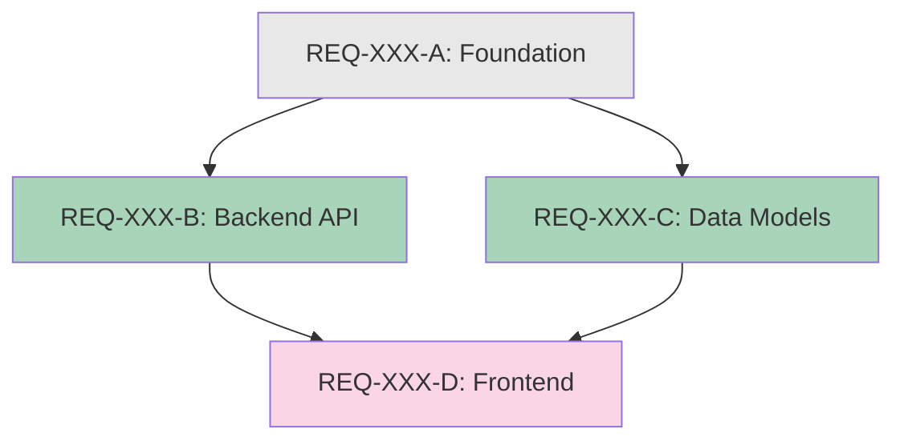

# Task Decomposition: Breaking Down the Monolith

When the spirits face a task too vast to complete in one haunting, the ancient art of decomposition must be invoked. This skill transforms overwhelming requirements into atomic, manageable pieces that can be executed efficiently - sometimes in parallel.

## When to Use

- **SPLIT Requirements:** Any requirement sized as SPLIT (>4 hours, >8 files)
- **Trigger Phrases:** "decompose", "break down", "split this requirement", "this is too big"
- **Command:** `/decompose REQ-XXX`
- **Proactive:** When you notice a requirement exceeds sizing limits during planning

## The One Sitting Rule

Every decomposed piece MUST be completable in one uninterrupted work session:

| Size | Time | Files | Lines | Use Case |
|------|------|-------|-------|----------|
| XS | 30min-1hr | 1-2 | <50 | Quick fixes, config changes |
| S | 1-2 hours | 2-4 | 50-150 | Single component features |
| M | 2-4 hours | 4-8 | 150-300 | Multi-component features |

**SPLIT triggers (must decompose):**
- >4 hours estimated time
- >8 files to create/modify
- >300 lines of changes
- >6 tasks in the task list

## Decomposition Process

### Step 1: Analyze the Requirement

Read the requirement and identify:

```markdown
## Decomposition Analysis: REQ-XXX

**Original Title:** [requirement title]
**Original Effort:** SPLIT (estimated X hours)
**Original Files:** [count] files

**Why SPLIT is needed:**
- [ ] Time exceeds 4 hours
- [ ] Files exceed 8
- [ ] Tasks exceed 6
- [ ] Complexity requires phased approach

**Domain Coverage:**
- [ ] Backend (APIs, services, models)
- [ ] Frontend (UI, components, state)
- [ ] Infrastructure (IaC, deployment, CI)
- [ ] Database (schema, migrations)
- [ ] Testing (unit, integration, E2E)
```

### Step 2: Identify Natural Boundaries

Find the natural seams where the requirement can be split:

**Decomposition Strategies:**

| Strategy | Best For | Example |
|----------|----------|---------|
| **Layer Split** | Full-stack features | DB -> Backend -> API -> Frontend |
| **Domain Split** | Cross-cutting concerns | Auth module, User module, Payment module |
| **Feature Slice** | User-facing features | CRUD operations split by action |
| **Risk Isolation** | Uncertain requirements | Spike -> Foundation -> Feature |
| **Dependency Chain** | Sequential requirements | Data model -> Service -> API -> UI |

### Step 3: Map Dependencies

Create a Directed Acyclic Graph (DAG) of task dependencies:

```
## Dependency DAG

          +---------------+
          | REQ-XXX-A     |
          | (Foundation)  |
          +-------+-------+
                  |
        +---------+---------+
        |                   |
+-------v-------+   +-------v-------+
| REQ-XXX-B     |   | REQ-XXX-C     |
| (Backend API) |   | (Data Models) |
+-------+-------+   +-------+-------+
        |                   |
        +---------+---------+
                  |
          +-------v-------+
          | REQ-XXX-D     |
          | (Frontend)    |
          +---------------+
```

**ASCII DAG Notation:**

```
A -> B, C     (A blocks both B and C)
B -> D        (B blocks D)
C -> D        (C blocks D)
```

This translates to:
- `REQ-XXX-B: Blocked by: REQ-XXX-A`
- `REQ-XXX-C: Blocked by: REQ-XXX-A`
- `REQ-XXX-D: Blocked by: REQ-XXX-B, REQ-XXX-C`

### Step 4: Identify Parallelization Opportunities

Tasks with no dependencies between them can run in parallel:

```markdown
## Parallelization Analysis

**Sequential (must be in order):**
A -> D  (A must complete before D can start)

**Parallel Opportunities:**
- B and C can run in parallel (both only depend on A)
- No dependencies between B and C

**Execution Schedule:**

Phase 1 (Sequential):  A
Phase 2 (Parallel):    B || C
Phase 3 (Sequential):  D

**Parallelization Ratio:** 2/4 tasks (50% parallelizable)
```

**Parallelization Markers:**

| Marker | Meaning |
|--------|---------|
| `||` | Can run in parallel |
| `->` | Must run sequentially |
| `+ A` | Can start after A completes |
| `@ Phase N` | Belongs to execution phase N |

### Step 5: Size Each Piece

Every decomposed piece must fit within sizing limits:

```markdown
## Decomposed Requirements

### REQ-XXX-A: [Foundation Task]
- **Effort:** S (1.5 hours)
- **Files:** 2 files
- **Tasks:** 3
- **Blocked by:** None
- **Parallelizable:** No (foundation)

### REQ-XXX-B: [Backend API]
- **Effort:** S (2 hours)
- **Files:** 4 files
- **Tasks:** 4
- **Blocked by:** REQ-XXX-A
- **Parallelizable:** Yes (with REQ-XXX-C)

### REQ-XXX-C: [Data Models]
- **Effort:** XS (45 min)
- **Files:** 2 files
- **Tasks:** 2
- **Blocked by:** REQ-XXX-A
- **Parallelizable:** Yes (with REQ-XXX-B)

### REQ-XXX-D: [Frontend Integration]
- **Effort:** M (3 hours)
- **Files:** 6 files
- **Tasks:** 5
- **Blocked by:** REQ-XXX-B, REQ-XXX-C
- **Parallelizable:** No (final integration)
```

### Step 6: Generate Roadmap Updates

Format decomposed requirements for the roadmap:

```markdown
## Batch X: [Original Requirement Name] (Decomposed)

### ⚪ REQ-XXX-A: [Foundation Task Title]

**Type:** Enhancement
**Reported:** YYYY-MM-DD
**Source:** Decomposed from REQ-XXX

**Description:**
[What this piece does]

**Tasks:**
- [ ] Task 1
- [ ] Task 2
- [ ] Task 3

**Files:**
- `path/to/file1.ext` (create)
- `path/to/file2.ext` (modify)

**Effort:** S
**Agent:** Dev-Backend
**Completion:** [Testable criteria for this piece]
**Blocked by:** None

---

### ⚪ REQ-XXX-B: [Backend API Title]
...
**Blocked by:** REQ-XXX-A

### ⚪ REQ-XXX-C: [Data Models Title]
...
**Blocked by:** REQ-XXX-A
**Note:** Can run in parallel with REQ-XXX-B

### ⚪ REQ-XXX-D: [Frontend Integration Title]
...
**Blocked by:** REQ-XXX-B, REQ-XXX-C
```

## DAG Visualization Guide

### ASCII DAG Format

Use ASCII art for simple dependency visualization:

**Linear Chain:**
```
A -> B -> C -> D
```

**Diamond Pattern (Parallel Middle):**
```
      A
     / \
    B   C
     \ /
      D
```

**Fan-Out Pattern:**
```
      A
    / | \
   B  C  D
```

**Fan-In Pattern:**
```
   A  B  C
    \ | /
      D
```

**Complex DAG:**
```
         A
        / \
       B   C
      /|   |\
     D E   F G
      \|   |/
       H   I
        \ /
         J
```

### Mermaid DAG Format

For more complex dependencies, use Mermaid syntax:



**Color Coding:**
- Gray (`#e8e8e8`): Sequential/blocking
- Green (`#a8d5ba`): Parallelizable
- Pink (`#f9d5e5`): Final integration

### Dependency Matrix

For many items, use a matrix:

```markdown
## Dependency Matrix

|          | A | B | C | D | E |
|----------|---|---|---|---|---|
| A        | - |   |   |   |   |
| B        | X | - |   |   |   |
| C        | X |   | - |   |   |
| D        |   | X | X | - |   |
| E        |   |   |   | X | - |

X = row depends on column
```

## Parallelization Recommendations

### When to Parallelize

**Good Candidates:**
- Different file sets (no overlap)
- Different technical domains
- No data dependencies
- Independent outcomes

**Poor Candidates:**
- Shared database migrations
- Same configuration files
- Interdependent data structures
- Sequential logic flow

### Parallelization Patterns

**Pattern 1: Domain Parallel**
```
          Foundation
         /    |    \
   Backend  Frontend  Infra
         \    |    /
         Integration
```
Each domain works independently after foundation.

**Pattern 2: Layer Parallel**
```
     API Design (Contract)
      /              \
   Backend          Frontend
   (implements)     (implements)
      \              /
       Integration Test
```
API contract enables parallel implementation.

**Pattern 3: Feature Parallel**
```
         Core Model
        /     |    \
   Create   Read   Update
        \     |    /
         E2E Tests
```
CRUD operations can be parallelized.

### Coordination Requirements

When recommending parallel execution:

1. **Define contracts first** - Shared interfaces before parallel work
2. **Assign file ownership** - No overlapping file modifications
3. **Plan integration point** - Where parallel streams merge
4. **Schedule sync points** - When to verify parallel work aligns

## Example Decomposition

### Original Requirement

```markdown
### SPLIT REQ-050: Add User Dashboard

**Type:** Enhancement
**Effort:** SPLIT (estimated 16 hours)
**Files:** 18 files

**Tasks:**
- [ ] Create dashboard data models
- [ ] Build dashboard API endpoints
- [ ] Implement caching layer
- [ ] Create dashboard UI components
- [ ] Add charts and visualizations
- [ ] Write unit tests
- [ ] Write E2E tests
- [ ] Add documentation
```

### After Decomposition

```markdown
## Batch 8: User Dashboard (Decomposed from REQ-050)

### ⚪ REQ-050-A: Dashboard Data Models

**Type:** Enhancement
**Effort:** S (1.5 hours)
**Files:**
- `src/models/dashboard.py` (create)
- `tests/models/test_dashboard.py` (create)

**Tasks:**
- [ ] Create DashboardMetrics model
- [ ] Create DashboardWidget model
- [ ] Write model unit tests

**Agent:** Dev-Backend
**Completion:** Models created with 100% test coverage
**Blocked by:** None

---

### ⚪ REQ-050-B: Dashboard API Endpoints

**Type:** Enhancement
**Effort:** M (3 hours)
**Files:**
- `src/api/dashboard.py` (create)
- `tests/api/test_dashboard.py` (create)
- `src/api/__init__.py` (modify)

**Tasks:**
- [ ] Create GET /api/dashboard endpoint
- [ ] Create GET /api/dashboard/widgets endpoint
- [ ] Add authentication middleware
- [ ] Write API tests

**Agent:** Dev-Backend
**Completion:** API returns correct dashboard data for authenticated users
**Blocked by:** REQ-050-A

---

### ⚪ REQ-050-C: Dashboard Caching Layer

**Type:** Enhancement
**Effort:** S (2 hours)
**Files:**
- `src/cache/dashboard.py` (create)
- `tests/cache/test_dashboard.py` (create)

**Tasks:**
- [ ] Implement Redis caching for dashboard data
- [ ] Add cache invalidation on data updates
- [ ] Write cache tests

**Agent:** Dev-Backend
**Completion:** Dashboard API responses cached with 5-minute TTL
**Blocked by:** REQ-050-A
**Note:** Can run in parallel with REQ-050-B

---

### ⚪ REQ-050-D: Dashboard UI Components

**Type:** Enhancement
**Effort:** M (3.5 hours)
**Files:**
- `src/components/Dashboard/index.tsx` (create)
- `src/components/Dashboard/DashboardCard.tsx` (create)
- `src/components/Dashboard/DashboardGrid.tsx` (create)
- `src/components/Dashboard/Dashboard.test.tsx` (create)

**Tasks:**
- [ ] Create DashboardCard component
- [ ] Create DashboardGrid layout component
- [ ] Create main Dashboard page
- [ ] Write component tests

**Agent:** Dev-Frontend
**Completion:** Dashboard components render correctly with mock data
**Blocked by:** REQ-050-B

---

### ⚪ REQ-050-E: Dashboard Charts and Visualizations

**Type:** Enhancement
**Effort:** M (2.5 hours)
**Files:**
- `src/components/Dashboard/Charts/LineChart.tsx` (create)
- `src/components/Dashboard/Charts/BarChart.tsx` (create)
- `src/components/Dashboard/Charts/Charts.test.tsx` (create)

**Tasks:**
- [ ] Create LineChart component with D3/Chart.js
- [ ] Create BarChart component
- [ ] Add chart animations and interactivity
- [ ] Write chart tests

**Agent:** Dev-Frontend
**Completion:** Charts render with sample data and respond to interactions
**Blocked by:** REQ-050-D
**Note:** Can run in parallel with REQ-050-F

---

### ⚪ REQ-050-F: Dashboard E2E Tests

**Type:** Enhancement
**Effort:** S (2 hours)
**Files:**
- `tests/e2e/dashboard.spec.ts` (create)

**Tasks:**
- [ ] Write E2E test for dashboard loading
- [ ] Write E2E test for widget interactions
- [ ] Write E2E test for chart rendering

**Agent:** Dev-Frontend
**Completion:** E2E tests pass for all dashboard user flows
**Blocked by:** REQ-050-D
**Note:** Can run in parallel with REQ-050-E
```

### Decomposition Summary

```markdown
## Decomposition Summary: REQ-050

**Original:** SPLIT (16 hours, 18 files)
**Decomposed into:** 6 requirements

### Dependency DAG

        REQ-050-A (Foundation)
             |
    +--------+--------+
    |                 |
REQ-050-B        REQ-050-C
(API)             (Cache)
    |                 |
    +--------+--------+
             |
        REQ-050-D (UI)
             |
    +--------+--------+
    |                 |
REQ-050-E        REQ-050-F
(Charts)         (E2E Tests)

### Parallelization Opportunities

**Phase 1:** A (Sequential - foundation)
**Phase 2:** B || C (Parallel - no dependencies)
**Phase 3:** D (Sequential - waits for API)
**Phase 4:** E || F (Parallel - no dependencies)

**Parallelization Ratio:** 4/6 tasks parallelizable (67%)
**Estimated Time Savings:** ~4 hours with parallel execution

### Agent Assignments

- Dev-Backend: A, B, C (6.5 hours)
- Dev-Frontend: D, E, F (8 hours)

### Execution Order (Optimal)

1. Spawn Dev-Backend for REQ-050-A
2. When A completes, spawn Dev-Backend for B and C in parallel
3. When B completes, spawn Dev-Frontend for REQ-050-D
4. When D completes, spawn Dev-Frontend for E and F in parallel
```

## Quality Checklist

Before finalizing decomposition:

- [ ] Every piece fits within XS/S/M sizing limits
- [ ] No piece exceeds 8 files or 4 hours
- [ ] Dependencies form a valid DAG (no cycles)
- [ ] Parallel opportunities identified
- [ ] Each piece has testable completion criteria
- [ ] Agent assignments are appropriate
- [ ] File paths are specific (no overlap between parallel tasks)
- [ ] Original requirement is marked as SPLIT or removed

## Anti-Patterns to Avoid

| Anti-Pattern | Problem | Fix |
|--------------|---------|-----|
| **Too granular** | XS pieces with no value alone | Combine related tasks |
| **Circular deps** | A -> B -> C -> A | Break the cycle |
| **Hidden deps** | Shared files not declared | Analyze file overlap |
| **Uneven sizing** | 1 XS, 1 XS, 1 M, 1 L | Rebalance pieces |
| **No integration piece** | Parallel work never merges | Add final integration task |
| **Premature parallel** | Parallel before contract defined | Define interfaces first |

## Integration with Other Skills

- **gco-roadmap-creation:** Use sizing rules and batch organization
- **gco-haunt-mode:** Use for parallel execution coordination
- **gco-orchestrator:** Invokes decomposition when SPLIT detected
- **gco-roadmap-workflow:** Update roadmap with decomposed items
